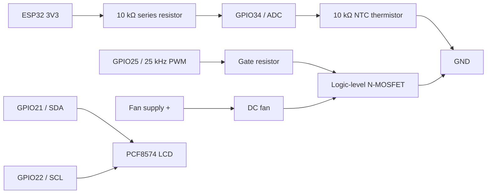

# Wiring schematic

Use a flyback diode when required by the fan/load, join the fan-supply and
ESP32 grounds, and verify MOSFET current/voltage ratings before assembly.
The firmware assumes the divider orientation shown above.
